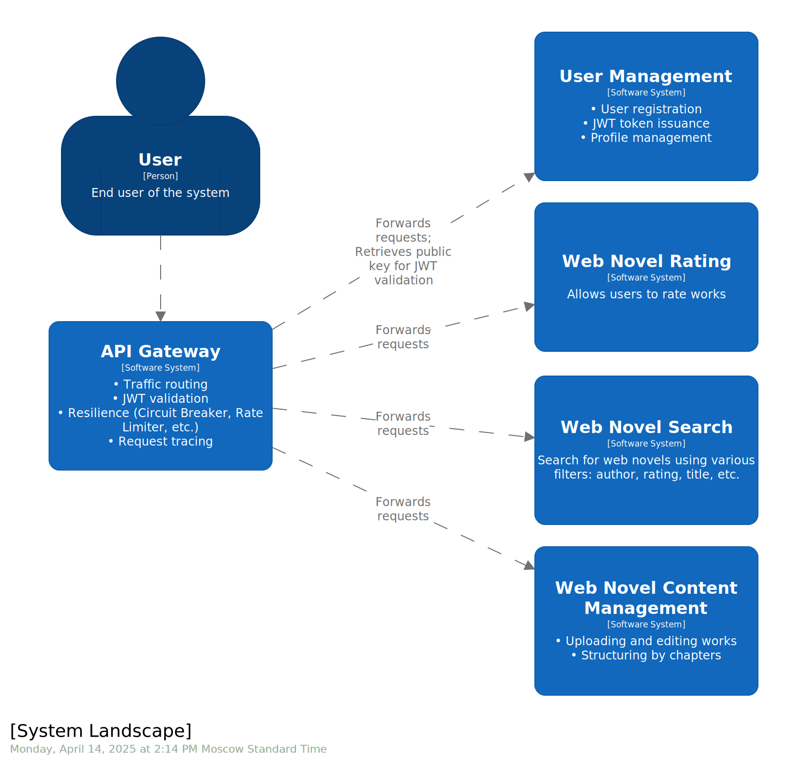

Platform for publishing and discovering web novels

The project consists of the following systems, described in [presentation](https://whsv26.github.io/2024-09-otus-spring-sviridov/1):
- API Gateway ([gateway](services/gateway))
- User Management ([user](services/user))
- Web Novel Content Management ([novel](services/novel))
- Web Novel Rating ([rating](services/rating))
- Web Novel Search ([search](services/search))



## How to Run

```shell
cd hw19-project-work
```

### With Docker Compose

Build the microservice images and load them into the local Docker daemon.
```shell
../mvnw clean && ../mvnw install -pl libs/outbox,libs/auth,libs/idempotency,services/novel/novel-model,services/rating/rating-model 
../mvnw compile jib:dockerBuild -pl services/gateway/gateway-api,services/user/user-api,services/novel/novel-api,services/novel/novel-outbox,services/search/search-indexer,services/search/search-api,services/rating/rating-api,services/rating/rating-consumer 
```

Start all services:
```shell
docker compose up
```

### In a Kubernetes Cluster (Minikube)

Start Minikube:
```shell
minikube start
```

Enable Nginx Ingress to access the cluster from the host machine.
Without a tunnel, Ingress might be unavailable from the host.
```shell
minikube addons enable ingress
```

On macOS, you need to start a tunnel. Without it, you won’t be able to access Ingress.
After starting it, you can access the cluster via http://localhost:80
```shell
minikube tunnel
```

On Linux, to access the cluster, use the IP address of Minikube, which can be obtained with the following command:
```shell
minikube ip
```

On Linux, you can override the baseUrl for the Minikube environment in IntelliJ's HTTP client using the following command:
```shell
cp http-client.env.json http-client.private.env.json
jq --arg ip "$(minikube ip)" '.minikube.baseUrl = "http://\($ip):80"' http-client.env.json > http-client.private.env.json
```

Build the microservice images and load them into Minikube’s Docker daemon (it has its own inside).
```shell
eval $(minikube docker-env)
../mvnw clean && ../mvnw install -pl libs/outbox,libs/auth,libs/idempotency,services/novel/novel-model,services/rating/rating-model 
../mvnw compile jib:dockerBuild -pl services/gateway/gateway-api,services/user/user-api,services/novel/novel-api,services/novel/novel-outbox,services/search/search-indexer,services/search/search-api,services/rating/rating-api,services/rating/rating-consumer
```

Deploy the application to Minikube (Helm and Helmfile are required):
```shell
helm plugin install https://github.com/databus23/helm-diff
helm repo add bitnami https://charts.bitnami.com/bitnami
helm repo add incubator https://charts.helm.sh/incubator
helm repo add jaegertracing https://jaegertracing.github.io/helm-charts
helmfile apply -e local -f deploy/helmfile.yaml
```

To roll back the deployment, clean everything with the following command:
```
helmfile destroy -e local -f deploy/helmfile.yaml
```

For Grafana, an Ingress is added for the host http://grafana.local for convenience.
To use it, you can add a new entry to `/etc/hosts`:
```shell
echo "$(minikube ip)$(printf '\t')grafana.local" | sudo tee -a /etc/hosts
```

## How to Update the C4 Diagram

Start Structurizr Lite:
```shell
cd hw19-project-work/structurizr
docker run -it --rm -p 8080:8080 -v ./:/usr/local/structurizr structurizr/lite
```

Now you can open, edit, and export the diagrams to SVG via the UI at http://localhost:8080.

## How to Update the Presentation

Start the dev server that renders the presentation at http://localhost:3030
```shell
cd hw19-project-work/presentation
npm i -g pnpm
pnpm install
pnpm dev
```

Make changes in [slides.md](presentation/slides.md)